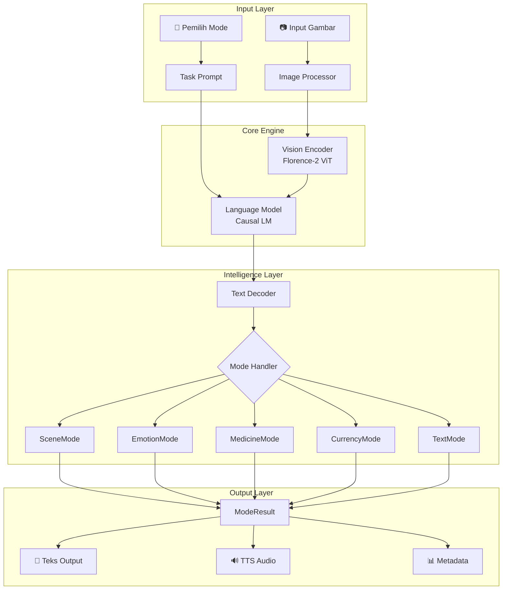
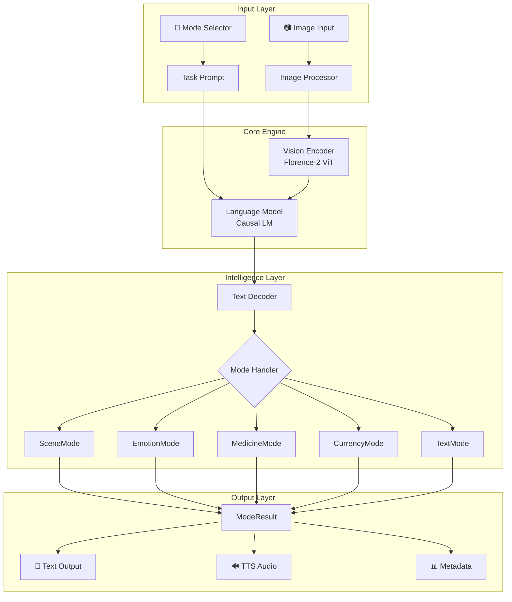

# 🏗️ Arsitektur DARA | DARA Architecture

[🇮🇩 Bahasa Indonesia](#bahasa-indonesia) | [🇺🇸 English](#english)

---

## Bahasa Indonesia

### Gambaran Umum Sistem

DARA dibangun dengan arsitektur Vision Language Model (VLM) modular yang mendukung 5 mode deteksi berbeda sambil mempertahankan ukuran yang ringan dan performa yang cepat.

### Diagram Arsitektur



### Komponen Utama

#### 1. 🖼️ Vision Encoder
- **Basis**: Florence-2 Vision Transformer (ViT)
- **Input**: Gambar RGB (otomatis resize)
- **Output**: Visual embeddings
- **Fitur**: Deteksi objek, kemampuan OCR bawaan

#### 2. 🧠 Language Model
- **Arsitektur**: Causal LM (autoregressive)
- **Parameter**: 0.23B (model dasar)
- **Task Prompts**:
  - `<MORE_DETAILED_CAPTION>` - Deskripsi detail
  - `<CAPTION>` - Caption singkat
  - `<OCR>` - Membaca teks

#### 3. 🎭 Mode Handler

Setiap mode memiliki handler khusus dengan logika pemrosesan cerdas:

| Mode | Handler | Prompt | Fungsi Utama |
|------|---------|--------|--------------|
| **Scene** | `SceneMode` | `<MORE_DETAILED_CAPTION>` | Deskripsi lingkungan + deteksi bahaya |
| **Emotion** | `EmotionMode` | `<CAPTION>` | Analisis ekspresi + saran sosial |
| **Medicine** | `MedicineMode` | `<OCR>` | Ekstraksi dosis + peringatan keamanan |
| **Currency** | `CurrencyMode` | `<OCR>` | Deteksi Rupiah + warna uang |
| **Text** | `TextMode` | `<OCR>` | OCR umum + format untuk suara |

#### 4. 📊 Confidence Scoring

Setiap prediksi memiliki skor kepercayaan (0.0 - 1.0):

```python
# Contoh output
{
    "text": "Terdeteksi: Rp 50.000 (warna biru)",
    "confidence": 0.85,
    "suggestions": ["Periksa ciri keamanan uang"]
}
```

#### 5. 💾 Caching Layer

```
┌─────────────────────┐
│   InferenceCache    │ ← LRU Cache (100 entries)
├─────────────────────┤
│   TTSCache          │ ← Audio file caching
├─────────────────────┤
│   TranslationCache  │ ← @lru_cache(500)
└─────────────────────┘
```

### Struktur Modul Baru

```
src/dara/
├── core/           # Komponen inti
│   ├── model.py    # Kelas DARA utama
│   ├── processor.py # Preprocessing gambar
│   └── inference.py # Engine inferensi
├── modes/          # Handler mode
│   ├── base.py     # Base class + ModeResult
│   ├── scene.py    # Mode deskripsi scene
│   ├── emotion.py  # Mode deteksi emosi
│   ├── medicine.py # Mode baca obat
│   ├── currency.py # Mode deteksi mata uang
│   └── text.py     # Mode OCR teks
├── services/       # Layer service
│   ├── tts.py      # Text-to-Speech
│   ├── translation.py # Terjemahan
│   └── cache.py    # LRU cache
└── utils/          # Utilitas
    ├── logging.py  # Sistem logging
    ├── text.py     # Pemrosesan teks
    └── image.py    # Utilitas gambar
```

### Optimasi Performa

| Fitur | Implementasi | Manfaat |
|-------|-------------|---------|
| **FP16** | Auto pada GPU | Memori 2x lebih efisien |
| **Inference Cache** | LRU 100 entries | Skip inferensi berulang |
| **TTS Cache** | Hash MD5 | Hindari regenerasi audio |
| **Batch Processing** | `prepare_batch()` | Proses banyak gambar sekaligus |

### Menambah Mode Baru

1. Buat file handler baru di `modes/`
2. Extend `BaseMode` class
3. Implementasi method `process()`
4. Daftarkan di `core/model.py`

```python
# Contoh: modes/barcode.py
class BarcodeMode(BaseMode):
    @property
    def name(self) -> str:
        return "barcode"
    
    @property
    def prompt(self) -> str:
        return "<OCR>"
    
    def process(self, raw_output: str, language: str) -> ModeResult:
        # Logika khusus barcode
        ...
```

---

## English

### System Overview

DARA is built on a modular Vision Language Model (VLM) architecture that supports 5 distinct detection modes while maintaining a lightweight footprint and fast performance.

### Architecture Diagram



### Core Components

#### 1. 🖼️ Vision Encoder
- **Base**: Florence-2 Vision Transformer (ViT)
- **Input**: RGB images (auto-resized)
- **Output**: Visual embeddings
- **Features**: Built-in object detection, OCR capabilities

#### 2. 🧠 Language Model
- **Architecture**: Causal LM (autoregressive)
- **Parameters**: 0.23B (base model)
- **Task Prompts**:
  - `<MORE_DETAILED_CAPTION>` - Detailed description
  - `<CAPTION>` - Brief caption
  - `<OCR>` - Text reading

#### 3. 🎭 Mode Handlers

Each mode has a dedicated handler with intelligent processing logic:

| Mode | Handler | Prompt | Main Function |
|------|---------|--------|---------------|
| **Scene** | `SceneMode` | `<MORE_DETAILED_CAPTION>` | Environment description + hazard detection |
| **Emotion** | `EmotionMode` | `<CAPTION>` | Expression analysis + social guidance |
| **Medicine** | `MedicineMode` | `<OCR>` | Dosage extraction + safety warnings |
| **Currency** | `CurrencyMode` | `<OCR>` | Rupiah detection + note colors |
| **Text** | `TextMode` | `<OCR>` | General OCR + speech formatting |

#### 4. 📊 Confidence Scoring

Every prediction includes a confidence score (0.0 - 1.0):

```python
# Example output
{
    "text": "Detected: Rp 50,000 (blue color)",
    "confidence": 0.85,
    "suggestions": ["Verify security features"]
}
```

#### 5. 💾 Caching Layer

```
┌─────────────────────┐
│   InferenceCache    │ ← LRU Cache (100 entries)
├─────────────────────┤
│   TTSCache          │ ← Audio file caching
├─────────────────────┤
│   TranslationCache  │ ← @lru_cache(500)
└─────────────────────┘
```

### New Module Structure

```
src/dara/
├── core/           # Core components
│   ├── model.py    # Main DARA class
│   ├── processor.py # Image preprocessing
│   └── inference.py # Inference engine
├── modes/          # Mode handlers
│   ├── base.py     # Base class + ModeResult
│   ├── scene.py    # Scene description mode
│   ├── emotion.py  # Emotion detection mode
│   ├── medicine.py # Medicine reading mode
│   ├── currency.py # Currency detection mode
│   └── text.py     # OCR text mode
├── services/       # Service layer
│   ├── tts.py      # Text-to-Speech
│   ├── translation.py # Translation
│   └── cache.py    # LRU cache
└── utils/          # Utilities
    ├── logging.py  # Logging system
    ├── text.py     # Text processing
    └── image.py    # Image utilities
```

### Performance Optimizations

| Feature | Implementation | Benefit |
|---------|---------------|---------|
| **FP16** | Auto on GPU | 2x memory efficiency |
| **Inference Cache** | LRU 100 entries | Skip repeated inferences |
| **TTS Cache** | MD5 hash | Avoid audio regeneration |
| **Batch Processing** | `prepare_batch()` | Process multiple images at once |

### Adding New Modes

1. Create new handler file in `modes/`
2. Extend `BaseMode` class
3. Implement `process()` method
4. Register in `core/model.py`

```python
# Example: modes/barcode.py
class BarcodeMode(BaseMode):
    @property
    def name(self) -> str:
        return "barcode"
    
    @property
    def prompt(self) -> str:
        return "<OCR>"
    
    def process(self, raw_output: str, language: str) -> ModeResult:
        # Barcode-specific logic
        ...
```

---

## Pertimbangan Keamanan | Security Considerations

| 🇮🇩 Bahasa Indonesia | 🇺🇸 English |
|---------------------|------------|
| **Validasi Input**: Batas ukuran gambar, pengecekan format | **Input Validation**: Image size limits, format checks |
| **Inferensi Aman**: Tidak ada eksekusi kode dari output model | **Safe Inference**: No code execution from model outputs |
| **Privasi**: Semua pemrosesan bisa dilakukan offline | **Privacy**: All processing can be done offline |
