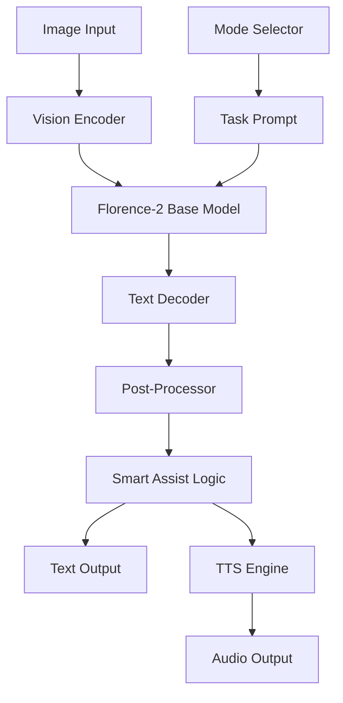

# DARA Architecture

## System Overview

DARA is built on a modular, multi-task Vision Language Model architecture that enables 5 distinct assistive modes while maintaining a small footprint.

## Architecture Diagram



## Core Components

### 1. Vision Encoder
- **Base**: Florence-2 Vision Transformer (ViT)
- **Input**: 224x224 RGB images
- **Output**: Visual embeddings
- **Features**: Native object detection, OCR capabilities

### 2. Language Model
- **Architecture**: Causal LM (autoregressive)
- **Parameters**: 0.23B (base model)
- **Task-specific prompts**: `<OD>`, `<CAPTION>`, `<OCR>`

### 3. Mode Router

```python
PROMPTS = {
    "scene": "<CAPTION>",      # Detailed description
    "emotion": "<CAPTION>",     # Facial analysis
    "medicine": "<OCR>",        # Label reading
    "currency": "<CAPTION>",    # Money identification
    "text": "<OCR>"             # General text reading
}
```

### 4. Smart Assist Layer

Post-processing logic that transforms raw model output into actionable advice:

```python
def _process_output(raw_text, mode):
    if mode == "emotion":
        # Keyword matching → emotion detection
        if "smile" in raw_text:
            return "Happy. They seem approachable."
    
    elif mode == "medicine":
        # Mock DB lookup for dosage info
        return f"{raw_text}. Standard dose: 500mg after food."
    
    # ... other modes
```

## Training Pipeline

### Fine-tuning Strategy

```
Pre-trained Florence-2
        ↓
   LoRA Adapters (r=16, α=32)
        ↓
   Multi-task Dataset
   ├── Scene (COCO)
   ├── Emotion (FER2013)
   ├── Medicine (Custom)
   ├── Currency (Custom)
   └── Text (OCR datasets)
        ↓
   Fine-tuned DARA
```

### LoRA Configuration

```python
LoraConfig(
    r=16,                      # Low-rank dimension
    lora_alpha=32,             # Scaling factor
    target_modules=["q_proj", "v_proj"],
    lora_dropout=0.05,
    bias="none",
    task_type="CAUSAL_LM"
)
```

## Inference Flow

1. **Image preprocessing**: Resize → Normalize
2. **Prompt injection**: Mode-specific task prompt
3. **Model forward pass**: Vision + Language encoding
4. **Beam search decoding**: Generate text (num_beams=3)
5. **Post-processing**: Smart assist logic
6. **TTS generation**: Text → Audio

## Performance Optimization

### Current
- **Device**: CPU/GPU auto-detection
- **Precision**: FP16 (GPU) / FP32 (CPU)
- **Latency**: ~200-500ms (CPU, unoptimized)

### Planned
- **Quantization**: INT8 via ONNX Runtime
- **Model pruning**: Remove unused layers
- **Target latency**: <100ms (mobile)

## Data Format

### Training Data Structure

```json
{
  "image": "path/to/image.jpg",
  "mode": "scene",
  "text": "A kitchen with modern appliances and a dining table."
}
```

### Inference Output

```python
{
  "mode": "scene",
  "result": "Scene Description: Kitchen with table. Stove is on.",
  "audio": "output.mp3"
}
```

## Extensibility

### Adding New Modes

1. Define new mode constant in `config.py`
2. Add prompt mapping
3. Implement post-processing logic in `model.py`
4. Prepare training data
5. Fine-tune with LoRA

### Model Upgrades

- **DARA → DARA-Pro**: Swap base model in `config.py`
- **LoRA → Full fine-tune**: Remove PEFT wrapper
- **Multi-lingual**: Change TTS language in `gTTS(lang='id')`

## Security Considerations

- **Input validation**: Image size limits, format checks
- **Safe inference**: No code execution from model outputs
- **Privacy**: All processing can be done offline (no external API calls)
